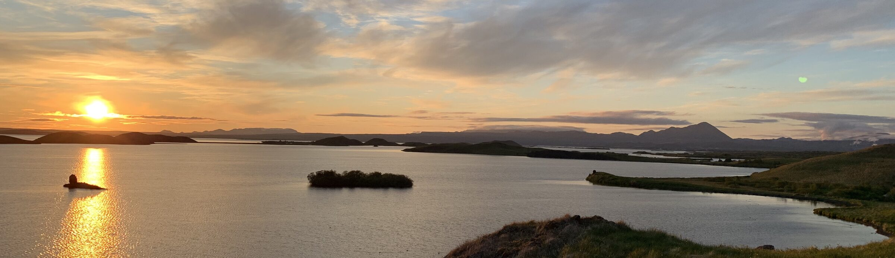
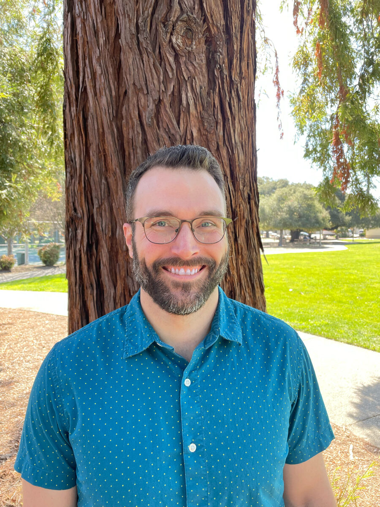

::: {.hero .column-screen}
{.hero-img fig-alt="Sunset over Lake Mývatn, Iceland"}

::: {.hero-text}
# Lucas A. Nell

Ecological and evolutionary processes, from genes to communities
:::
:::

::: {.prose}
{fig-alt="Portrait of Lucas A. Nell" width="280"}

I am a biologist that studies how interacting ecological and evolutionary
dynamics can transform patterns of biodiversity, from genes to communities.
My approach combines data-intensive empirical methods (e.g., experiments,
genomics) with mathematical models based on specific biology, primarily in
insect systems. Because my empirical work often requires complex data
analysis, I also [develop software](resources.qmd) where the need arises.

I am currently a Postdoctoral Associate in the
[Department of Ecology & Evolutionary Biology](https://ecologyandevolution.cornell.edu)
at Cornell University, where I work with
[Dr. Megan Greischar](https://ecologyandevolution.cornell.edu/megan-greischar).
:::
