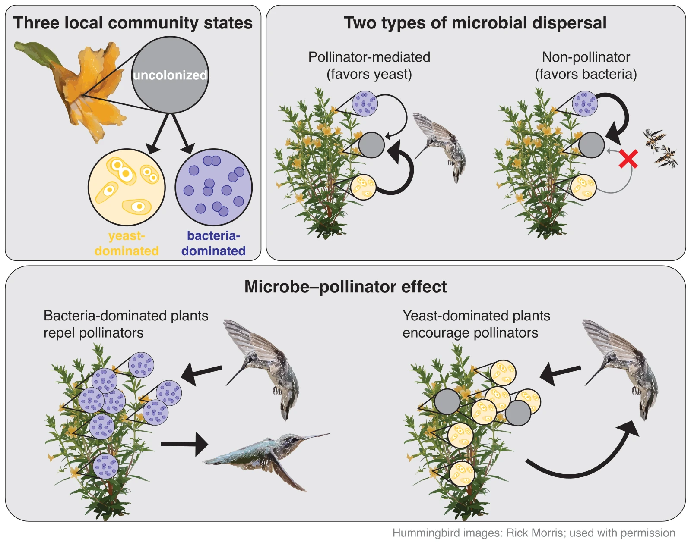

## What maintains feedbacks between ecology and evolution?

Feedbacks between evolutionary and ecological processes that occur because
they operate on similar timescales is called eco-evo dynamics. For eco-evo
dynamics to persist, the variation underlying both processes must be
maintained, yet this fundamental component of eco-evo dynamics has received
little attention. Pea aphids can evolve resistance to parasitoid wasps rapidly
enough to affect the host--parasitoid dynamics. Through long-term lab
experiments and simulations, we showed that moderate aphid dispersal among
fields combined with non-random parasitoid dispersal cause both species
coexistence and balancing selection. These two forms of dispersal together
resulted in stable, persistent eco-evo dynamics
[(Nell et al., *Science*)](https://www.science.org/stoken/author-tokens/ST-1758/full).

## How does population ecology shape genome evolution?

I am leveraging the extreme biology of chironomid midges (family
Chironomidae, order Diptera) to understand how population ecology shapes
genome evolution in natural populations. Chironomids are the most widely
distributed group of freshwater insects and inhabit a vast range of habitats,
many of which are inhospitable (e.g., Antarctica, hot springs). Yet we know
little about the shared features underlying chironomids' ability to tolerate
extreme environments and how they achieve this despite especially compact
genomes. In a recent paper, I described a number of candidate genes and gene
families that may relate to chironomid tolerance to stress and show that
their compact genomes are via reductions in repeat and non-coding elements
[(Nell et al. 2024, *Genome Biology and Evolution*)](https://doi.org/10.1093/gbe/evae086).
In a related project, I am using an example of extreme population dynamics to
understand what happens to genetic diversity when populations experience
frequent, short-duration bottlenecks. The population of *Tanytarsus
gracilentus* at Lake Mývatn, Iceland, has irregular population fluctuations
of about 5 orders of magnitude. In collaboration with Árni Einarsson
(Director, Mývatn Research Station), I collected and sequenced
*T.&nbsp;gracilentus* samples from Mývatn that spanned 24 years and 3
population crashes, and from 15 other lakes across northern Iceland. Our
results so far are consistent with theoretical predictions about the effects
of short-duration population crashes: population crashes cause a relative
absence of rare alleles but have only moderate effects on overall nucleotide
diversity. We have also identified a number of genes under selection due to
midge abundance, mostly related to male fertility and responses to
starvation. Further analyses will provide greater insights into how the
complex population dynamics present in many real populations shapes
genome-wide patterns of genetic diversity.

## How can feedbacks between dispersal and community composition affect regional coexistence?

Non-random dispersal can promote regional coexistence despite local priority
effects and negligible immigration. In the many cases of animal-mediated
dispersal, hitchhikers can coexist regionally when animal vectors respond to
environmental cues. However, this possibility has been poorly understood,
particularly when local priority effects lead to history-dependent exclusion.
We used a mathematical model of competitive communities of nectar microbes in
sticky monkeyflower (*Diplacus aurantiacus*) to study how feedbacks between
microbial communities and pollinator-mediated dispersal affect coexistence.
Analysis of this model suggests that regional coexistence occurs only when
microbial communities influence pollinator visit frequency. This
microbe--pollinator feedback creates positive density-dependence at the plant
scale that results in spatial niche partitioning across multiple plants. This
partitioning facilitates mutual invasibility and stable regional coexistence
of microbes. Our results highlight the importance of interactions between
dispersal and community composition across scales in shaping patterns of
species coexistence (Nell et al. in prep.;
[preprint](https://doi.org/10.1101/2025.03.31.646410)).

## When do spatial dynamics change outcomes of species interactions?

The effects of species interactions on communities often change with
conditions in ways that remain unclear. Common plant epiphytic bacteria in
the genus *Pseudomonas* can kill and repel pea aphids that transmit costly
viruses among pea plants, which could provide local benefits to peas.
However, repelling of aphids could lead to greater crowding and
disproportionately more production of winged aphids on low-*Pseudomonas*
plants. An increase in winged aphids should increase aphid-mediated virus
transmission, resulting in negative effects on pea plants at larger spatial
scales. Further complicating these interactions, plant viruses can often
attract insect vectors, and by reducing aphid densities, aphid predators and
parasitoids may modify how this symbiosis affects pea plants by reducing
aphid crowding. We used mathematical modeling to understand when the
*Pseudomonas*--pea symbiosis is a net benefit versus cost for pea plants. Our
results indicate that by killing aphids, *Pseudomonas* is usually beneficial
to pea plants. However, when natural enemies (parasitoid wasps) suppress
aphid abundances, they can make the pseudo-crowding effect more pronounced
and cause *Pseudomonas* presence to have a net negative effect on pea plants.
Our results provide a rare case study of how spatial scale and community
interactions can together dictate the nature of multipartite and multitrophic
interactions.

## Can trait coevolution among competitors promote coexistence?

Coevolution among competitors can result in traits that promote niche
partitioning and coexistence or traits that promote greater conflict and
competitive exclusion. We used an eco-evolutionary model where competitors
"invest" in coexistence- and exclusion-promoting traits to assess when trait
coevolution should promote coexistence or exclusion. We found that
communities should often contain both types of traits, but
exclusion-promoting traits should more strongly influence trait coevolution
community-wide. We also found that, despite being more influential, species
invested relatively more in exclusion-promoting traits should be most
vulnerable to exclusion by a new invader. This may make communities
containing multiple species with exclusion-promoting traits transitory
(Nell et al. in revision;
[preprint](https://doi.org/10.1101/2022.11.01.514799)).
