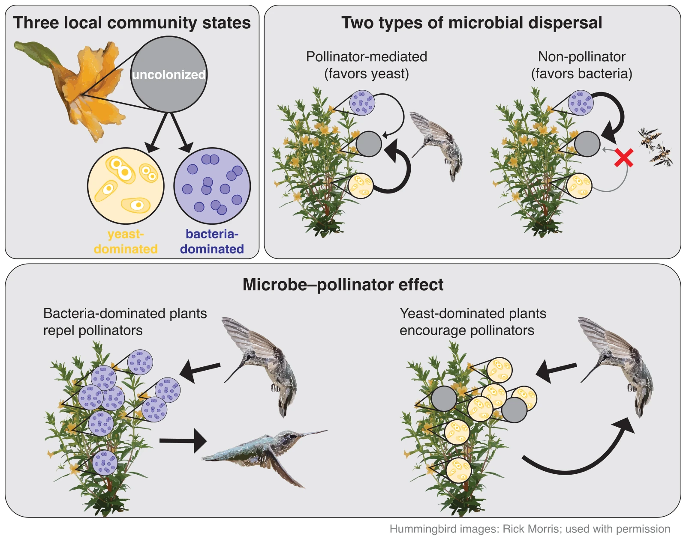

I'm most interested in how organisms interact, disperse, and evolve, and how
these linked processes generate patterns of biodiversity.
Questions that are especially fascinating to me:

* How do ecological outcomes change once we account for trait evolution?
* When do large-scale patterns emerge from connected processes operating at
  small spatial scales?
* How do species interactions and population processes shape molecular evolution?

To address these questions, I combine mathematical and statistical modeling, 
experiments, and genomics.
Using a broad arrange of approaches also allows me to understand how ecology
and evolution operate across scales, from molecules to metacommunities.

## What maintains feedbacks between ecology and evolution?

Feedbacks between evolutionary and ecological processes that occur because
they operate on similar timescales is called eco-evo dynamics. For eco-evo
dynamics to persist, the variation underlying both processes must be
maintained, yet this fundamental component of eco-evo dynamics has received
little attention. Pea aphids can evolve resistance to parasitoid wasps rapidly
enough to affect the host--parasitoid dynamics. Through long-term lab
experiments and simulations, we showed that moderate aphid dispersal among
fields combined with non-random parasitoid dispersal cause both species
coexistence and balancing selection. These two forms of dispersal together
resulted in stable, persistent eco-evo dynamics
[(Nell et al., *Science*)](https://www.science.org/stoken/author-tokens/ST-1758/full).

## How does population ecology shape genome evolution?

I am leveraging the extreme biology of chironomid midges (family
Chironomidae, order Diptera) to understand how population ecology shapes
genome evolution in natural populations. Chironomids are the most widely
distributed group of freshwater insects and inhabit a vast range of habitats,
many of which are inhospitable (e.g., Antarctica, hot springs). Yet we know
little about the shared features underlying chironomids' ability to tolerate
extreme environments and how they achieve this despite especially compact
genomes. In a recent paper, I described a number of candidate genes and gene
families that may relate to chironomid tolerance to stress and show that
their compact genomes are via reductions in repeat and non-coding elements
[(Nell et al. 2024, *Genome Biology and Evolution*)](https://doi.org/10.1093/gbe/evae086).
In a related project, I am using an example of extreme population dynamics to
understand what happens to genetic diversity when populations experience
frequent, short-duration bottlenecks. The population of *Tanytarsus
gracilentus* at Lake Mývatn, Iceland, has irregular population fluctuations
of about 5 orders of magnitude. In collaboration with Árni Einarsson
(Director, Mývatn Research Station), I collected and sequenced
*T.&nbsp;gracilentus* samples from Mývatn that spanned 24 years and 3
population crashes, and from 15 other lakes across northern Iceland. Our
results so far are consistent with theoretical predictions about the effects
of short-duration population crashes: population crashes cause a relative
absence of rare alleles but have only moderate effects on overall nucleotide
diversity. We have also identified a number of genes under selection due to
midge abundance, mostly related to male fertility and responses to
starvation. Further analyses will provide greater insights into how the
complex population dynamics present in many real populations shapes
genome-wide patterns of genetic diversity.

## When do natural enemies change the impact of plant microbiota on insect-borne virus transmission?

Individual hosts can be protected from disease vectors through 
their microbiota, but how those benefits scale up to the host 
population level is rarely obvious. 
Disease spread may be inhibited through reduced vector visitation
or amplified as vectors redirect their attention to unprotected hosts.
The outcome---suppression or escalation of disease outbreaks---is 
likely to be influenced by natural enemies that redistribute or suppress
vector populations.
The challenge of determining how these processes interact across 
scales is exemplified by pea aphids, major virus vectors in pea crops 
that are commonly managed using parasitoid wasps.
Recent evidence suggests that epiphytic bacteria in the genus 
*Pseudomonas* can repel or kill pea aphids, 
yet whether *Pseudomonas*-mediated protection from aphids 
complements or undermines parasitoid-based vector control remains 
unknown.
We developed a multi-scale mathematical model to investigate why
*Pseudomonas* complements versus undermines biocontrol of 
aphid-vectored virus outbreaks.
Because *Pseudomonas*-induced mortality leaves aphids patchily 
distributed, the effect of *Pseudomonas* on virus outbreaks depends
most strongly on how well parasitoids track aphid densities.
When parasitoids efficiently locate aphids,
*Pseudomonas* inhibits virus outbreaks by reducing aphid densities.
However, when parasitoids are less efficient, they often search 
unproductively for aphids on *Pseudomonas*-inhabited plants 
with few aphids, slowing parasitoid population growth.
Reduced parasitism intensifies aphid crowding on *Pseudomonas*-free 
plants and boosts the production of winged aphids that accelerate viral
spread.
Counterintuitively, the more effective *Pseudomonas* is at killing 
aphids, the more strongly it generates spatial variability and promotes 
virus spread.
Our results show how community context dictates whether individual 
microbiota protection slows or accelerates viral outbreaks at the 
population scale.
(Nell et al. in review;
[preprint](https://doi.org/10.64898/2026.05.11.724421)).

## How can feedbacks between dispersal and community composition affect regional coexistence?

Non-random dispersal can promote regional coexistence despite local priority
effects and negligible immigration. In the many cases of animal-mediated
dispersal, hitchhikers can coexist regionally when animal vectors respond to
environmental cues. However, this possibility has been poorly understood,
particularly when local priority effects lead to history-dependent exclusion.
We used a mathematical model of competitive communities of nectar microbes in
sticky monkeyflower (*Diplacus aurantiacus*) to study how feedbacks between
microbial communities and pollinator-mediated dispersal affect coexistence.
Analysis of this model suggests that regional coexistence occurs only when
microbial communities influence pollinator visit frequency. This
microbe--pollinator feedback creates positive density-dependence at the plant
scale that results in spatial niche partitioning across multiple plants. This
partitioning facilitates mutual invasibility and stable regional coexistence
of microbes. Our results highlight the importance of interactions between
dispersal and community composition across scales in shaping patterns of
species coexistence (Nell et al. in prep.;
[preprint](https://doi.org/10.1101/2025.03.31.646410)).

## Can trait coevolution among competitors promote coexistence?

Coevolution among competitors can result in traits that promote niche
partitioning and coexistence or traits that promote greater conflict and
competitive exclusion. We used an eco-evolutionary model where competitors
"invest" in coexistence- and exclusion-promoting traits to assess when trait
coevolution should promote coexistence or exclusion. We found that
communities should often contain both types of traits, but
exclusion-promoting traits should more strongly influence trait coevolution
community-wide. We also found that, despite being more influential, species
invested relatively more in exclusion-promoting traits should be most
vulnerable to exclusion by a new invader. This may make communities
containing multiple species with exclusion-promoting traits transitory
(Nell et al. in revision;
[preprint](https://doi.org/10.1101/2022.11.01.514799)).

